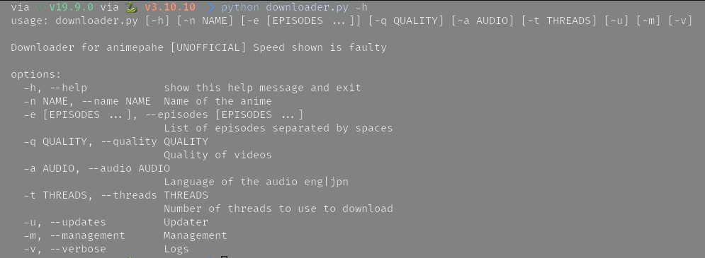

# AnimePahe Downloader

[](https://badge.fury.io/py/animepahe-dl)
[](https://opensource.org/licenses/MIT)
[](https://github.com/ayushjaipuriyar/animepahe-dl/actions/workflows/ci.yml)
[](https://github.com/ayushjaipuriyar/animepahe-dl/actions/workflows/release.yml)
[](https://www.python.org/downloads/)
[](https://github.com/astral-sh/uv)
[](https://github.com/astral-sh/ruff)
[](https://github.com/psf/black)

A feature-rich, high-performance anime downloader for AnimePahe with both CLI and GUI interfaces. Built with Python, featuring concurrent downloads, resume support, and cross-platform compatibility.



## 📋 Table of Contents

- [Highlights](#-highlights)
- [Features](#features)
- [Installation](#installation)
- [Usage](#usage)
- [Configuration](#configuration)
- [For Developers](#️-for-developers)
- [Performance Tips](#-performance-tips)
- [Troubleshooting](#-troubleshooting)
- [Documentation](#-documentation)
- [Docker Support](#-docker-support)
- [Advanced Usage](#-advanced-usage)
- [New Features](#-new-features-in-v521)
- [License](#-license)
- [Acknowledgments](#-acknowledgments)

## ✨ Highlights

- 🚀 **High Performance**: Concurrent segment downloads with configurable thread pools
- 💾 **Smart Caching**: Reduces redundant API calls and improves response times
- 🔄 **Resume Support**: Continue interrupted downloads seamlessly
- 🎨 **Dual Interface**: Choose between CLI for automation or GUI for ease of use
- ▶️ **Direct Streaming**: Play episodes instantly without downloading
- 🔔 **Desktop Notifications**: Get notified when downloads complete
- 🌐 **Cross-Platform**: Works on Windows, macOS, and Linux
- 📦 **Auto-Updates**: Automatic cache updates for the latest anime releases
- 🎯 **Flexible Selection**: Download single episodes, ranges, or entire series

## Features

*   **Search and Download**: Find any anime on AnimePahe and download it.
*   **Direct Streaming**: Play episodes directly without downloading using m3u8 streams.
*   **Batch Downloads**: Download entire series or select specific episodes.
*   **Resume Support**: Resume interrupted downloads without starting over.
*   **Cross-Platform**: Works on Windows, macOS, and Linux.
*   **Desktop Notifications**: Get notified when your downloads are complete.
*   **Automatic Cache Updates**: Keep your local anime list up-to-date automatically.

## Installation

### 1. Prerequisites

Before installing, ensure you have the following dependencies on your system:

*   **Python 3.8+**: [Download Python](https://www.python.org/downloads/)
*   **ffmpeg**: Essential for merging video segments.
    *   **Windows**: Download from [ffmpeg.org](https://ffmpeg.org/download.html) and add to your system's PATH.
    *   **macOS**: `brew install ffmpeg`
    *   **Linux**: `sudo apt update && sudo apt install ffmpeg` (or use your distro's package manager).
*   **fzf**: Required for the interactive anime selection in the CLI.
    *   **Windows**: Download from the [fzf GitHub releases](https://github.com/junegunn/fzf/releases) and add to your PATH.
    *   **macOS**: `brew install fzf`
    *   **Linux**: `sudo apt update && sudo apt install fzf` (or use your distro's package manager).
*   **Node.js**: Required for an internal dependency.
    *   [Download Node.js](https://nodejs.org/en/download/) or use a package manager.
*   **Media Player** (for streaming): Required only if you want to use the `--play` feature.
    *   **mpv** (recommended): `sudo apt install mpv` (Linux), `brew install mpv` (macOS), or download from [mpv.io](https://mpv.io/)
    *   **VLC**: Download from [videolan.org](https://www.videolan.org/)
    *   **ffplay** (part of FFmpeg): Usually installed with ffmpeg
    *   **mplayer**: Available in most package managers

### 2. Install with uv (Recommended - Fast!)

```bash
# Install uv if you haven't already
curl -LsSf https://astral.sh/uv/install.sh | sh

# Install animepahe-dl
uv tool install animepahe-dl
```

### 3. Install with pip

```bash
pip install animepahe-dl
```

## Usage

The package can be run directly from your terminal.

### Command-Line Interface (CLI)

To run the CLI, use the `animepahe-dl` command:

```bash
# Search for an anime and select episodes interactively
animepahe-dl -n "Your Anime Name"

# Download specific episodes of an anime
animepahe-dl -n "Your Anime Name" -e 1 3 5
```

**CLI Options:**

| Flag | Alias | Description | Default |
|---|---|---|---|
| `--name` | `-n` | Name of the anime to search for. | |
| `--episodes` | `-e` | List or range of episode numbers (e.g., `1 2 5` or `1-10`). | |
| `--quality` | `-q` | Desired video quality (`best`, `1080`, `720`, `480`, `360`). | `best` |
| `--audio` | `-a` | Desired audio language (`eng` or `jpn`). | `jpn` |
| `--threads` | `-t` | Number of download threads for segments. | `100` |
| `--concurrent-downloads` | `-c` | Number of episodes to download concurrently. | `2` |
| `--updates` | | Check for new episodes of anime in your personal list. | |
| `--manage` | | Manage your personal anime list (add/remove anime). | |
| `--run-once` | | Use with `--updates` to run the check once and exit. | |
| `--insecure` | | Disable SSL certificate verification (not recommended). | |
| `--m3u8-only` | | Fetch playlist only without downloading segments. | |
| `--play` | | Play episode(s) directly using m3u8 stream (requires media player). | |
| `--player` | | Specify media player to use (mpv, vlc, ffplay). Auto-detects if not specified. | |
| `--daemon` | | Run in daemon mode (background service for continuous updates). | |
| `--daemon-action` | | Daemon management (start, stop, restart, status). | |
| `--single` | | Disable multi-selection mode (select only one anime at a time). | |
| `--gui` | | Launch the Graphical User Interface. | |

**Examples:**

```bash
# Search and select anime (multi-selection is default)
animepahe-dl -n "Naruto"
# (Use spacebar to select multiple items, Enter to confirm)

# Download episodes 1-10 with 720p quality
animepahe-dl -n "Naruto" -e 1-10 -q 720

# Download multiple episodes concurrently
animepahe-dl -n "Naruto" -e 1-20 -c 3 -t 150

# Download with English audio
animepahe-dl -n "Naruto" -e 1-5 -a eng

# Single selection mode (select only one anime)
animepahe-dl -n "Naruto" --single

# Fetch playlist only (no download)
animepahe-dl -n "Naruto" -e 1 --m3u8-only

# Play episodes directly without downloading
animepahe-dl -n "Naruto" -e 1-5 --play

# Play with specific media player
animepahe-dl -n "Naruto" -e 1 --play --player mpv
```


### Graphical User Interface (GUI)

To launch the GUI, use the `--gui` flag:

```bash
animepahe-dl --gui
```

The GUI provides a user-friendly interface for searching, selecting, and downloading anime without using the command line.

**Multi-Selection in GUI:**
- Hold `Ctrl` (or `Cmd` on macOS) to select multiple anime
- Hold `Shift` to select a range of anime
- Click "Download Selected" to download all episodes from selected anime
- Click "Play Selected Episodes" to stream episodes directly (requires media player)

**Keyboard Shortcuts:**
- `Ctrl+F` - Focus search bar
- `Ctrl+A` - Select all episodes
- `Ctrl+D` - Deselect all episodes
- `Ctrl+P` - Play selected episodes
- `Enter` - Download selected episodes
- `F5` - Update anime cache

### Direct Streaming

Stream episodes instantly without downloading:

```bash
# Stream episodes directly
animepahe-dl -n "Your Anime Name" -e 1-5 --play

# Use specific media player
animepahe-dl -n "Your Anime Name" -e 1 --play --player mpv

# Stream with custom quality and audio
animepahe-dl -n "Your Anime Name" -e 1 --play -q 720 -a eng
```

**Supported Media Players:**
- **mpv** (recommended) - Lightweight and fast
- **VLC** - Popular cross-platform player
- **ffplay** - Part of FFmpeg, minimal interface
- **mplayer** - Classic media player

The application will auto-detect available players or you can specify one with `--player`.

### Background Monitoring & Daemon Mode

Run the application as a background service to automatically monitor and download new episodes:

```bash
# Start daemon mode
animepahe-dl --daemon

# Daemon management
animepahe-dl --daemon-action start
animepahe-dl --daemon-action stop
animepahe-dl --daemon-action restart
animepahe-dl --daemon-action status
```

### System Tray Integration

The GUI supports system tray functionality:

- **Minimize to Tray**: Close button minimizes to system tray instead of quitting
- **Background Monitoring**: Toggle automatic episode checking from tray menu
- **Quick Actions**: Update cache, show/hide window, and quit from tray menu
- **Notifications**: Get desktop notifications for new episodes and completed downloads

### Linux Service Integration

Install as a systemd service for automatic startup:

```bash
# Install service (run from project directory)
./scripts/install-service.sh

# Service management
sudo systemctl start animepahe-dl
sudo systemctl stop animepahe-dl
sudo systemctl status animepahe-dl
sudo journalctl -u animepahe-dl -f  # View logs
```

**Service Features:**
- Automatic startup on boot
- Automatic restart on failure
- Secure execution with limited permissions
- Centralized logging via systemd journal

## Configuration

The application's configuration (`config.json`) and data files (`myanimelist.txt`, `animelist.txt`) are stored in your user data directory:

*   **Linux**: `~/.config/anime_downloader/`
*   **macOS**: `~/Library/Application Support/anime_downloader/`
*   **Windows**: `C:\Users\<YourUsername>\AppData\Local\anime_downloader\`

You can manually edit `config.json` to change defaults for quality, audio, threads, download directory, and notification settings.

**Configuration Options:**
```json
{
  "base_url": "https://animepahe.si",
  "quality": "best",
  "audio": "jpn",
  "threads": 100,
  "download_directory": "/home/user/Videos/Anime",
  "update_interval_hours": 1,
  "allow_insecure_ssl": true
}
```

## 🛠️ For Developers

### Development Setup

1. **Install uv** (if not already installed):
   ```bash
   curl -LsSf https://astral.sh/uv/install.sh | sh
   # Or on Windows: powershell -c "irm https://astral.sh/uv/install.ps1 | iex"
   ```

2. **Clone the repository:**
   ```bash
   git clone https://github.com/ayushjaipuriyar/animepahe-dl.git
   cd animepahe-dl
   ```

3. **Install dependencies with uv:**
   ```bash
   uv sync --all-extras
   ```

   Or for development:
   ```bash
   uv sync --dev
   ```

### Running Tests

```bash
# Run all tests
uv run pytest

# Run with coverage
uv run pytest --cov=anime_downloader --cov-report=html

# Run specific test file
uv run pytest tests/test_cli.py -v
```

### Code Quality

```bash
# Format code
uv run black anime_downloader tests
uv run isort anime_downloader tests

# Lint code
uv run ruff check anime_downloader tests

# Type checking
uv run mypy anime_downloader

# Security scan
uv run bandit -r anime_downloader
```

### Project Structure

```
animepahe-dl/
├── anime_downloader/       # Main package
│   ├── api.py             # AnimePahe API client
│   ├── async_downloader.py # Async download implementation
│   ├── cache.py           # Caching system
│   ├── cli.py             # Command-line interface
│   ├── config.py          # Configuration management
│   ├── downloader.py      # Download orchestration
│   ├── gui.py             # PyQt6 GUI
│   ├── models.py          # Data models
│   ├── utils.py           # Utility functions
│   └── workers.py         # Background workers
├── tests/                 # Test suite
├── .github/workflows/     # CI/CD pipelines
└── pyproject.toml        # Project configuration
```

### Contributing

We welcome contributions! Please follow these guidelines:

1. **Fork the repository** and create a feature branch
2. **Follow code style**: Use `black` and `isort` for formatting
3. **Write tests**: Maintain or improve code coverage
4. **Use Conventional Commits**: Follow the commit message format below
5. **Update documentation**: Keep README and docstrings current

#### Conventional Commits

This project uses [Conventional Commits](https://www.conventionalcommits.org/) for automated releases:

- `feat:` New features (minor version bump)
- `fix:` Bug fixes (patch version bump)
- `docs:` Documentation changes
- `style:` Code style changes (formatting, etc.)
- `refactor:` Code refactoring
- `perf:` Performance improvements
- `test:` Test additions or modifications
- `chore:` Build process or auxiliary tool changes

Example:
```bash
git commit -m "feat: add async download support for improved performance"
git commit -m "fix: handle network timeout errors gracefully"
```

### Release Process

Releases are automated via GitHub Actions:
1. Push to `main` branch triggers semantic-release
2. Version is bumped based on commit messages
3. Changelog is generated automatically
4. Package is published to PyPI
5. GitHub release is created

## 📊 Performance Tips

- **Increase threads**: Use `-t 100` or higher for faster downloads
- **Concurrent episodes**: Use `-c 3` to download multiple episodes simultaneously
- **Quality selection**: Lower quality downloads faster (use `-q 720` instead of `1080`)
- **Cache management**: Regularly update cache with `--updates` for better performance

## 🐛 Troubleshooting

### Common Issues

**SSL Certificate Errors:**
```bash
animepahe-dl --insecure -n "Anime Name"
```

**FFmpeg not found:**
- Ensure ffmpeg is installed and in your PATH
- Set `FFMPEG` environment variable to ffmpeg binary path

**Cache issues:**
- Delete cache directory: `~/.config/anime_downloader/cache/`
- Update cache: Run with `--updates` flag

**Permission errors:**
- Check download directory permissions
- Run with appropriate user privileges

## 📝 License

This project is licensed under the MIT License - see the [LICENSE](LICENSE) file for details.

## 📚 Documentation

- **[Quick Start Guide](QUICKSTART.md)** - Get started in 5 minutes
- **[API Documentation](docs/API.md)** - Complete API reference
- **[Contributing Guide](CONTRIBUTING.md)** - How to contribute
- **[Security Policy](SECURITY.md)** - Security and vulnerability reporting
- **[Upgrade Guide](docs/UPGRADE_GUIDE.md)** - Version upgrade instructions
- **[UV Migration Guide](docs/UV_MIGRATION.md)** - Migrating to UV package manager
- **[Examples](examples/)** - Usage examples and scripts
- **[Benchmarks](benchmarks/)** - Performance benchmarks

## 🐳 Docker Support

Run animepahe-dl in a container:

```bash
# Build the image
docker build -t animepahe-dl .

# Run CLI
docker run -v ./downloads:/downloads animepahe-dl -n "Anime Name" -e 1-5

# Run with docker-compose
docker-compose up
```

See [docker-compose.yml](docker-compose.yml) for configuration options.

## 🔧 Advanced Usage

### Using as a Python Library

```python
from anime_downloader.api import AnimePaheAPI
from anime_downloader.downloader import Downloader

# Initialize
api = AnimePaheAPI(verify_ssl=False)
downloader = Downloader(api)

# Search for anime
results = api.search("Naruto")
print(results[0]['title'])

# Download episodes
# See examples/ directory for complete examples
```

### Automation with Cron

Check for new episodes automatically:

```bash
# Edit crontab
crontab -e

# Add this line (check every 6 hours)
0 */6 * * * /usr/local/bin/animepahe-dl --updates --run-once
```

### Environment Variables

- `FFMPEG` - Path to ffmpeg binary
- `XDG_CONFIG_HOME` - Config directory location
- `DOWNLOAD_DIR` - Default download directory

## 🚀 New Features in v6.0.0

### Major Features
- ▶️ **Direct Streaming** - Play episodes instantly without downloading using m3u8 streams
- 🎮 **Media Player Integration** - Auto-detects mpv, VLC, ffplay, and mplayer with optimized streaming settings
- 🖥️ **GUI Streaming** - Stream episodes directly from the graphical interface with play button
- 🔔 **Desktop Notifications** - Get notified when downloads complete or new episodes are found
- 🖥️ **System Tray Support** - Run in background with system tray integration and context menu
- 🔄 **Daemon Mode** - Continuous background monitoring for new episodes with configurable intervals
- 🐧 **Systemd Integration** - Linux service support for automatic startup and management

### Improvements
- 🎯 **Enhanced Episode Selection** - Fixed episode range filtering (e.g., "1", "1-5", "1,3,5") in interactive mode
- 🔧 **Improved Architecture** - Cleaned up codebase by removing duplicate and unused components
- ⚡ **Better Performance** - Optimized imports and reduced code duplication
- 🛠️ **Enhanced CLI** - Improved mpv integration with proper streaming headers and buffering
- 📱 **Better GUI** - Fixed import errors and improved episode status tracking

### Previous Features
- ⚡ **Async Downloads** - 2-3x faster with async/await
- 💾 **Smart Caching** - 50% reduction in API calls
- 📊 **Performance Monitoring** - Track download statistics
- 🔄 **Concurrent Episodes** - Download multiple episodes simultaneously
- 🐳 **Docker Support** - Easy containerized deployment
- 🧪 **Comprehensive Testing** - Full test suite with pytest
- 📝 **Type Hints** - Better IDE support and error detection
- 🛠️ **UV Support** - 10-100x faster dependency management

See [CHANGELOG.md](CHANGELOG.md) for complete version history.

## 🙏 Acknowledgments

- AnimePahe for providing the content platform
- Contributors and users for feedback and improvements
- Open source community for the amazing tools and libraries
- [Astral](https://astral.sh/) for the amazing UV package manager

## ⚠️ Disclaimer

This tool is for educational purposes only. Please respect copyright laws and support official releases when available. The developers are not responsible for any misuse of this software.
